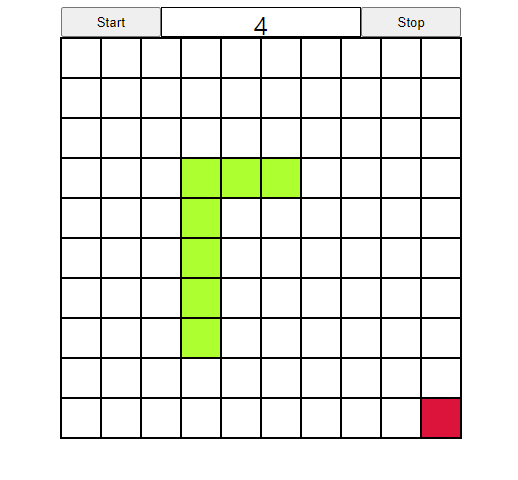

# Snake Game

## Overview
**Snake Game** is a simple web-based game where your task is to control a snake to eat apples and accumulate points. The snake grows longer each time it eats an apple, and the game ends if it collides with the walls or itself. The game speed gradually increases, so challenge yourself to achieve a higher score!

## Preview


## Features
- **Randomly appearing apples** increase your score when eaten.
- **Speed increase**: The snake's speed increases each time an apple is consumed.
- Simple **keyboard controls** (arrow keys) to maneuver the snake.
- Score display feature.

## Technologies Used
- [](https://developer.mozilla.org/en-US/docs/Web/Guide/HTML/HTML5)
- [](https://developer.mozilla.org/en-US/docs/Web/CSS)
- [](https://developer.mozilla.org/en-US/docs/Web/JavaScript)
- [](https://code.visualstudio.com/)

## How to Play
1. Clone this repository.
2. Open the `index.html` file in your web browser to launch the game.
3. Click the **Start button** to begin the game.
4. Use the **arrow keys** to control the snake and eat apples to score points.
5. The speed will increase each time you eat an apple, so aim for a higher score!
6. The game ends if the snake collides with the walls or itself.


## Installation
Clone the repository:
```bash
git clone https://github.com/Salkogi07/Snake_Game.git
```

## Contributing
Contributions are welcome! If you have any suggestions, bug fixes, or improvements, please fork the repository and create a pull request.

## Credits
- Developed by SALKOGI07

## License
This project is licensed under the MIT License.
